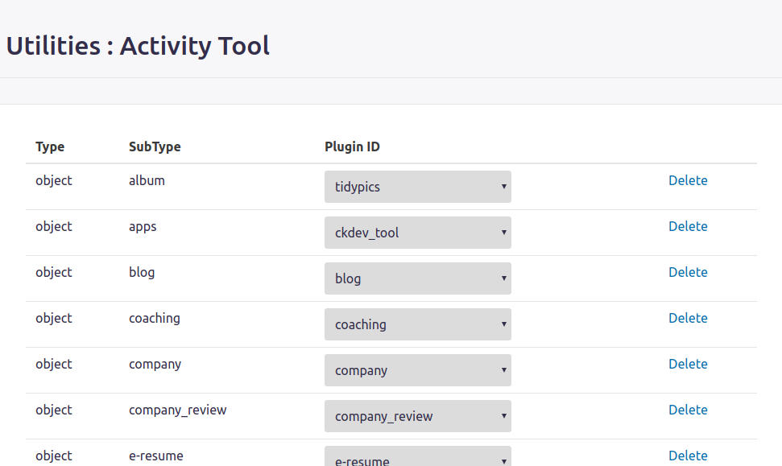
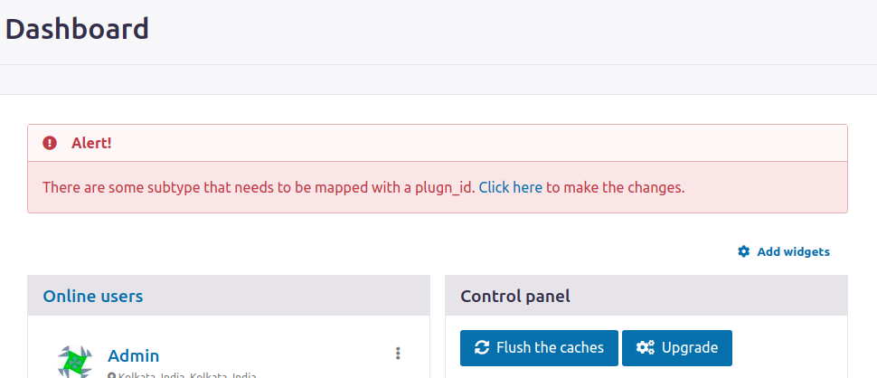
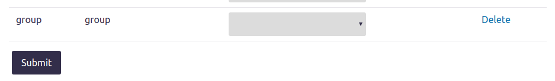

# Activity Tool v3.0.alpha

Elgg 3.0 has a limitation where the river activity does not get enabled/disabled on plugin activation/deactivation. As a result the river activities for the disabled plugins are shown without a valid view or language string.

More Details Here: https://github.com/Elgg/Elgg/issues/12514

This plugin enable the site administrator to overcome the problem.

# Instruction on using the plugin

- You will have to map the type, subtype of the entity to a plugin id (This mapping needs to be done manually)

- Once the mapping is complete, the river activity activation and deactivation is taken care by this plugin hooks.

- If you have not mapped any type, subtype of the entity to a plugin id then the following error message is shown in your admin dashboard.

- Once you click on "Click here", it will redirect you to the Utility page of "Activity Tool" and at the bottom of the list you can find all the un-mapped entries.

Note: This is plugin is in alpha stage.

Please report any issue at https://github.com/rohit1290/activity_tool/issues